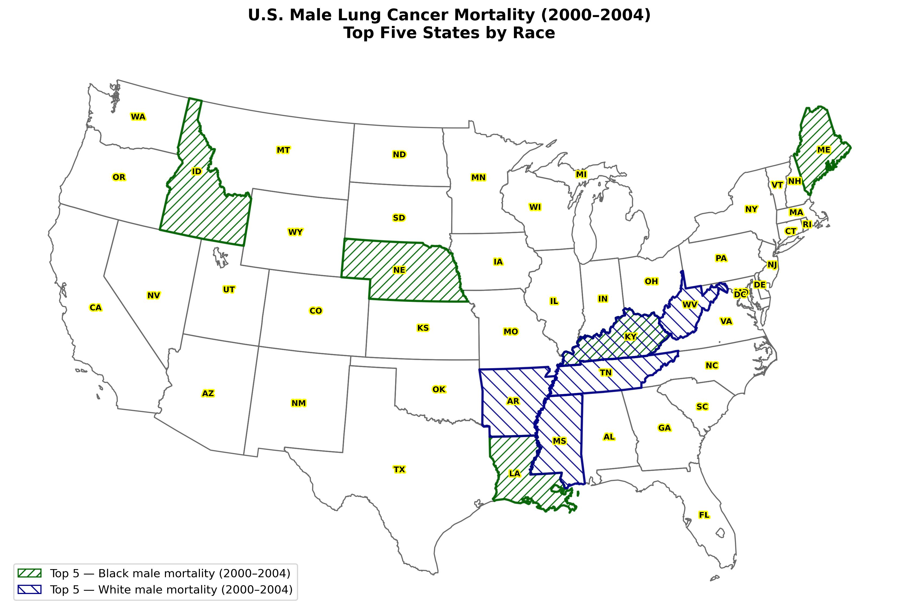

# Assignment 2: U.S. Lung Cancer Mortality (Python Replication)

Python replication of an ArcGIS Pro exercise from *GIS Tutorial for Health* (Kurland & Gorr).

> **Context:** This work was completed alongside an ArcGIS Pro–based assignment .  The Python implementation.

---

## What this repo demonstrates

- Reading ESRI File Geodatabase (`.gdb`) layers directly into GeoPandas.
- Reprojection to **Albers Equal Area Conic (EPSG:5070)** — the appropriate CONUS projection for area-based public health mapping.
- Attribute-based selection (top-N filtering) as a pandas operation.
- Publication-quality cartography in matplotlib, including hollow fills, hatched overlays, halo-masked labels, and JPEG export at 300 dpi.

## Assignments included

| Assignment | Geography           | Notebook                                |
|------------|---------------------|------------------------------------------|
| 2-1        | U.S. states         | `notebooks/assignment_2_1_state_level.ipynb` |
| 2-2        | Kentucky counties   | *(completed)*                          |

## Data

Data is **not** committed to this repository.

- **Source:** National Cancer Institute (NCI) Cancer Mortality Maps tool — [gis.cancer.gov](https://gis.cancer.gov).
- **Vintage:** 2000–2004 mortality rates per 100,000 population, stratified by race and sex.
- **Distribution:** Packaged in the *GIS Tutorial for Health* (Kurland & Gorr) companion data as `NCI.gdb`.

Expected local structure (gitignored):

```
data/
└── NCI.gdb/
    ├── LungState
    ├── LungCounty
    └── ...
```

## Environment

```bash
python -m venv .venv
source .venv/bin/activate  # macOS / Linux
pip install geopandas pandas matplotlib pyogrio jupyterlab
```

Tested with:
- Python 3.11
- geopandas 0.14+
- matplotlib 3.7+
- pyogrio (preferred) or fiona for `.gdb` reading

## How to run

```bash
cd assignment-02-lung-cancer-mortality
jupyter lab notebooks/assignment_2_1_state_level.ipynb
```

Adjust `DATA_DIR` and `STATE_COL` in the configuration cell to match your local data layout.

## Outputs produced

- `outputs/maps/Assignment2_1_Oladeji.jpg` — combined map with top-5 states for both race groups.
- `outputs/tables/top5_black_male_mortality.csv` — top 5 states, Black male mortality 2000–2004.
- `outputs/tables/top5_white_male_mortality.csv` — top 5 states, White male mortality 2000–2004.

## Notes on the ArcGIS Pro ↔ Python correspondence

Some ArcGIS cartographic elements have no exact matplotlib equivalent. The replication preserves analytical intent, not pixel-perfect rendering:

| ArcGIS Pro element                  | Python equivalent                                | Fidelity |
|-------------------------------------|--------------------------------------------------|----------|
| Hollow fill + gray outline          | `facecolor="none", edgecolor="dimgray"`          | Exact    |
| Yellow halo label mask              | `matplotlib.patheffects.withStroke`              | Close    |
| 10% Simple hatch at 45° / 135°      | `hatch="///"` / `hatch="\\\\"`                   | Approximate (angle is fixed by matplotlib) |
| JPEG export                         | `fig.savefig(..., dpi=300, format="jpeg")`       | Exact    |


## Results


The five highest-mortality states for White males cluster in a contiguous Appalachian and Mid-South belt (Kentucky, West Virginia, Tennessee, Arkansas, Mississippi), while the top five for Black males are geographically dispersed — a pattern partly attributable to small-denominator instability in states with low Black populations. Mississippi and Louisiana appear in both rankings, identifying them as cross-population priority areas. Full interpretive discussion is provided in the notebook.
## License

Code released under MIT.
Curriculum and assignment design © Dr. Diego Cuadros — used here with permission for portfolio purposes.
